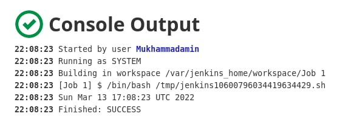
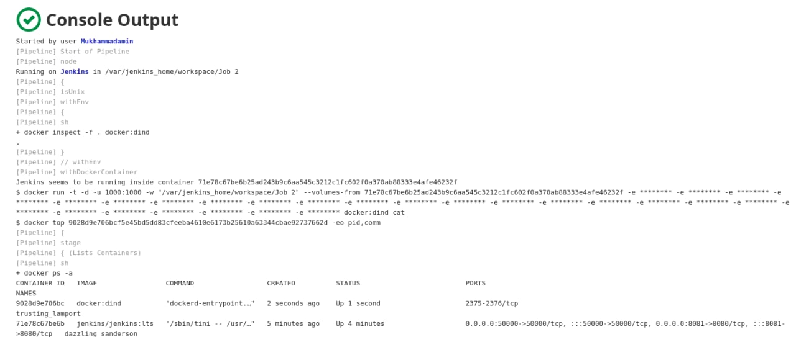
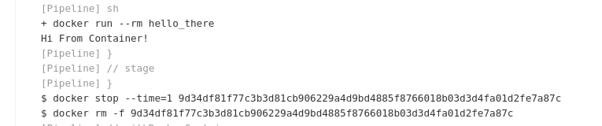

# Jenkins
#### Run Jenkins in Container `jenkins/jenkins` image with lts -- long term support tag used.
`docker run -p 8080:8080 -p 50000:50000 -d -v jenkins_home:/var/jenkins_home jenkins/jenkins:lts`
#### Execute Shell used to print Current Date

#### Docker Agent Configured in Jenkins Server

----------
#### Running Container after building image from Dockerfile in ./extra is available
 